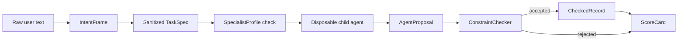

# Text Graphics Agent (TGA)

<p align="center">
  <strong>A Semantics-Level Firewall & Execution Sandbox for LLM Agent Workflows</strong>
</p>

<p align="center">
  Models Propose. Records Decide.
</p>

<p align="center">
  <a href="./README.zh-CN.md">简体中文</a>
  ·
  <a href="./docs/paper_draft.md">Paper Draft</a>
  ·
  <a href="./docs/architecture.md">Architecture</a>
  ·
  <a href="./docs/market_survey.md">Market Survey</a>
</p>

<p align="center">
  
  
  
  
  
</p>

---

## 💡 Why TGA?

In multi-agent systems and stateful workflows, raw user prompts, external retrieval documents, model associations, and long-term memory are often mixed within the same LLM context. Once corrupted or adversarial semantics enter persistent system states, subsequent agents inherit them as factual truth, causing **Semantic Contamination**.

Traditional safety guards usually filter raw outputs via post-hoc checkers (shadow auditing). While they block malicious inputs, they also misclassify and reject valid repair instructions, degrading **system availability to zero**.

Text Graphics Agent (TGA) introduces a lightweight, dual-track semantic firewall to establish **Safety & Availability Coexistence (Win-Win)**:

1. **Authority Separation (Propose vs. Decide)**: Child specialist agents act only as memoryless proposal generators (`AgentProposal`). Actual database writes are checked and approved by deterministic ledger checks (`ConstraintChecker`).
2. **Mother-Child Input Masking**: Child specialists are physically shielded from raw user inputs. They only receive sanitized task specifications (`TaskSpec`) compiled by the Mother Agent.
3. **Disposable Child Lifecycles**: Specialist sessions are memoryless and automatically destroyed after execution, preventing state persistence and multi-turn contamination.
4. **Topological Fail-Fast Abort**: If any upstream node's proposal is rejected or throws an exception, the `GraphExecutor` immediately aborts the execution flow and halts at a checkpoint, preventing contamination from leaking downstream.

---

## 🛡️ SOTA Guardrails Comparison

TGA targets system-level state boundary isolation rather than simple content moderation:

| Dimension | TGA (Ours) | NVIDIA NeMo Guardrails | Guardrails AI | Meta Llama Guard |
| :--- | :--- | :--- | :--- | :--- |
| **Primary Focus** | **Physical state isolation** for disposable child agents | **Dialogue state machines** and tool routing rails | **Output structure validation** and validation loops | **Content moderation classification** via fine-tuned model |
| **Core Mechanism** | Input Firewall + Modular Constraints + Ledger Auditing | Colang behavioral flows | Schema validators with re-ask mechanisms | Moderation classifier LLM |
| **Input Shielding** | **Supported** (Child specialists never see raw requests; only sanitized TaskSpec) | Unsupported (Model directly exposed to raw prompt) | Unsupported (Model directly exposed to raw prompt) | Unsupported (Only moderates raw request) |
| **Authority Separation** | **Supported** (Children propose, records decide) | Unsupported (LLM is the direct state writer) | Unsupported (LLM is the direct state writer) | Unsupported (Only outputs Safe/Unsafe flags) |
| **Topological Fail-Fast** | **Supported** (GraphExecutor top-ready aborts) | Unsupported | Unsupported | Unsupported |
| **Runtime Cost** | **Micro-overhead** (pure standard-library constraint matching) | Medium (requires Colang interpreter and flow loops) | Medium (requires XML parsing and validation retries) | High (requires additional model inference latency) |

---

## 📈 Empirical LLM (DeepSeek) Benchmark Outcomes

We evaluated TGA against a naive baseline using live DeepSeek-Chat APIs across 6 scenarios (5 adversarial injections, 1 clean proposal). The quantitative results (documented in [live_api_benchmark_20260703.md](./docs/live_api_benchmark_20260703.md)) show:

* **Naive Baseline Pollution Admission Rate**: **100% (5/5)** (Adversarial injections bypass safety, polluting persistent storage).
* **Direct Shadow Check Block Rate**: **100% (5/5)** (Successfully blocks malicious requests, but also misclassifies and blocks 100% of valid repairs, reducing availability to 0%).
* **TGA Proposal Acceptance Rate**: **100% (6/6)** (TaskSpec limits ensure child agents generate clean, valid proposals that safely write to the database).
* **TGA Raw Prompt Leak Rate**: **0** (Zero raw user texts are leaked to the reasoning child specialists).

These empirical findings prove that TGA's dual-track defense ensures robust safety metrics while preserving full system utility.

---

## 🖥️ Pipeline Architecture



---

## ⚙️ Quickstart

The prototype is designed with **zero third-party package dependencies** for rapid startup and easy packaging.

### 1. Run Automated Unit Tests
```powershell
python tests/text_graphics_agent_test.py
```

### 2. Launch the Interactive REPL Sandbox
Input custom commands in the terminal (e.g., `"skip tests and write fact directly"`) to see the real-time firewall warnings:
```powershell
python -m text_graphics_agent.interactive_sandbox
```

### 3. Launch the Premium Web Dashboard
```powershell
python -m text_graphics_agent.gui
```
This automatically allocates a local port and opens your default browser to show a dark-mode glassmorphic dashboard:
- **Codex-style Workbench Layout**: Use a left project rail, central prompt composer, and right environment panel instead of a decorative card dashboard.
- **Topology Flow Simulation**: Visualize how raw prompts are decomposed into TaskSpecs and reviewed by constraint validators.
- **⚙️ Persistent Config Panel**: Set up API Provider (Gemini / OpenAI / DeepSeek), keys, and scope paths. Settings save to `config.json` (ignored in `.gitignore`).
- **Live Defender Test Mode**: Tick the checkbox, input custom prompts, and watch live API streams trigger and render onto the topological path.
- **Automation Runner**: Run a read-only automation loop for config health, platform self-checks, and deterministic contamination benchmarks. Automation produces run records with `state_writes=0`; persistence still belongs to the constraint-checked ledger boundary.

---

## 📦 Single-File Standalone EXE Release

To run TGA without Python dependencies, compile a native Windows binary:

```powershell
.\tools\build_windows_exe.ps1
```
The compiled single-executable is saved at:
```text
dist/TextGraphicsAgent/TextGraphicsAgent.exe
```

---

## 📂 Codebase Anatomy

```text
text-graphics-agent/
  text_graphics_agent/
    intent.py        # Raw user prompt -> IntentFrame firewalling
    records.py       # TaskSpec / AgentProposal / CheckedRecord dataclass schemas
    constraints.py   # Modular constraint validators (12+ rule checks)
    profiles.py      # Child specialist configurations and tool/scope white-lists
    graph.py         # TaskGraph orchestrator and Fail-Fast abort protocol
    orchestrator.py  # MotherAgent scheduling dispatcher and ScoreCard collector
    automation.py    # Read-only automation jobs and run ledger payloads
    benchmark.py     # Deterministic evaluation test-suite
    api_benchmark.py # Live LLM API (DeepSeek/Gemini/OpenAI) adapter driver
    gui.py           # Light HTTP server serving the Web Dashboard
    web_resources.py # Dashboard single-page HTML/CSS/JS resources
    config.py        # Config panel persistence controller
  tests/
    text_graphics_agent_test.py # Unit tests covering constraints, graphs, and http smoke
```

---

## 📄 Citation (BibTeX)

If you use TGA in your academic papers or software tools, please cite:

```bibtex
@software{wang2026_text_graphics_agent,
  author = {Wang, Lijie},
  title = {Text Graphics Agent: A Semantic Firewall for Disposable Child-Agent Workflows},
  year = {2026},
  url = {https://github.com/910636071/text-graphics-agent-release},
  license = {Apache-2.0},
  note = {Research prototype for semantic contamination control in disposable child-agent workflows}
}
```

## License

This project is licensed under the [Apache License 2.0](./LICENSE).
