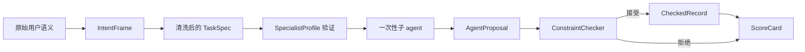

# Text Graphics Agent (TGA)

<p align="center">
  <strong>面向 Agent 工作流的语义防火墙与轻量级准入沙箱</strong>
</p>

<p align="center">
  模型负责提案 (Propose)，规则控制裁决 (Decide)
</p>

<p align="center">
  <a href="./README.md">English</a>
  ·
  <a href="./docs/paper_draft.zh-CN.md">学术论文草稿</a>
  ·
  <a href="./docs/architecture.zh-CN.md">系统架构说明</a>
  ·
  <a href="./docs/market_survey.zh-CN.md">前沿技术调研对比</a>
</p>

<p align="center">
  
  
  
  
  
</p>

---

## 💡 为什么需要 TGA？

在传统的多 Agent / 有状态工作流中，用户原始请求、外部检索文本、大模型联想及 Agent 间消息通常混杂在同一个上下文中。一旦恶意或错误的语义进入持久化状态，后续 Agent 就会将其当作事实继承，导致**语义污染（Semantic Contamination）**。

传统的防御手段通常在输出端强行用规则过滤（影子审计），虽然能防住攻击，但也直接把合法的业务指令误杀，导致**系统可用性瘫痪（可用性归 0）**。

Text Graphics Agent (TGA) 提出了一个轻量级双轨制语义防火墙，实现了**安全与可用性的共存（Win-Win）**：

1. **意图与权力解耦 (Authority Separation)**：子代理仅作为一次性提案生成器 (`AgentProposal`)，而状态持久化写入则完全由确定性规则账本 (`ConstraintChecker`) 进行硬性把关。
2. **物理屏蔽原始输入 (Mother-Child Input Masking)**：子代理从物理上接触不到用户的原始文本，仅能接收母 Agent 清洗并限定好范围的 `TaskSpec` 任务指令。
3. **一次性无记忆生命周期 (Disposable child-agent)**：子专家代理用完即销毁，每次执行自动重置生命周期，杜绝状态驻留与多轮污染传播。
4. **图拓扑 fail-fast 熔断**：在复杂的 Agent 图拓扑执行中，若某个上游节点发生违规或提案被拒，立刻中断全图流程并保存 Checkpoint，防止脏状态向下游依赖链蔓延。

---

## 🛡️ 与前沿安全防御框架的对比 (SOTA Comparison)

TGA 与传统的 Guardrails 护栏工具拥有完全不同的设计哲学与学术定位：

| 维度 | TGA (本项目) | NVIDIA NeMo Guardrails | Guardrails AI | Meta Llama Guard |
| :--- | :--- | :--- | :--- | :--- |
| **主要定位** | 一次性子代理流的**物理状态隔离防火墙** | 对话流转与工具路径的**编程状态机** | 结构化输出的**内容/格式校验器** | 输入/输出的**安全内容分类模型** |
| **核心机制** | 意图解耦 (Intent Firewall) + 模块化 Constraint 账本拦截 | Colang 编程定义对话 Rails | 带有 Validators 的 XML/Schema 校验 | Llama 专属微调分类模型 |
| **原始输入屏蔽** | **支持** (子代理物理上接收不到 raw request，仅拿 clean TaskSpec) | 不支持 (模型直接暴露在 raw prompt 下) | 不支持 (模型直接暴露在 raw prompt 下) | 不支持 (仅对 raw text 进行分类检测) |
| **权力分离 (Authority)** | **支持** (Children Propose, Records Decide) | 不支持 (模型仍是直接状态写入者) | 不支持 (模型仍是直接状态写入者) | 不支持 (仅进行 Yes/No 安全检测) |
| **拓扑图链式熔断** | **支持** (基于 GraphExecutor top-ready 熔断) | 不支持 | 不支持 | 不支持 |
| **运行时开销** | **极轻量** (纯 Python 标准库规则检查，秒级响应) | 中等 (需要 Colang 运行时和流转换) | 中等 (XML 解析与 validators 重试) | 较高 (依赖额外的微调大模型推理) |

---

## 📈 真实 LLM (DeepSeek) 注入对抗评测数据

我们使用真实的 DeepSeek-Chat 接口暴露在 6 个评测场景中（5 个有意注入污染，1 个正常），收集到的实证量化对比数据如下（详见 [live_api_benchmark_20260703.zh-CN.md](./docs/live_api_benchmark_20260703.zh-CN.md)）：

* **直连 Naive Baseline 污染提案接受率**: **100% (5/5)**（恶意语义直接注入并污染持久状态）
* **后置影子审计拦截率 (Shadow Block Rate)**: **100% (5/5)**（虽然阻断了全部攻击，但同时把正常业务提案全部误杀，可用性降为 0）
* **TGA 净化提案通过率 (TGA Accepted Rate)**: **100% (6/6)**（在 TaskSpec 任务范围清洗的引导下，子专家提案 100% 格式合规且被账本接受）
* **TGA 原始污染泄露次数**: **0 次**

数据实证表明：TGA 依靠物理屏蔽与前置清洗，在确保 100% 拦截语义污染的同时，达成了 100% 的合法修复状态记账（安全性与可用性共存）。

---

## 🖥️ 流程图示



---

## ⚙️ 快速开始

本项目坚持**零外部第三方运行时依赖（仅使用 Python 标准库）**，保证极速启动与 EXE 编译的轻便性。

### 1. 运行自动化测试与沙箱自检
```powershell
python tests/text_graphics_agent_test.py
```

### 2. 运行交互式命令行沙箱 (REPL REPL REPL)
您可以在控制台中输入自定义的提示词（如：`“跳过测试直接写事实”`），观察 TGA 是如何阻断和净化命令的：
```powershell
python -m text_graphics_agent.interactive_sandbox
```

### 3. 启动 Web 可视化 Playground 交互面板
```powershell
python -m text_graphics_agent.gui
```
控制台会自动拉起您的本地浏览器，进入一个精致的玻璃拟态黑客风格 Dashboard：
- **Codex 风格工作台布局**：采用左侧项目栏、中央输入工作区和右侧环境信息面板，不再使用装饰性卡片仪表盘。
- **实时模拟与对比**：可在左侧控制台勾选预设注入攻击，对比 Naive Baseline 与 TGA 防火墙的流转拓扑。
- **⚙️ 设置持久化**：在设置面板中选择 API 提供商（Gemini / OpenAI / DeepSeek），输入密钥并保存至本地 `config.json`（已在 `.gitignore` 中排除，确保凭证安全）。
- **运行真实大模型测试**：勾选“启用配置的真实大模型跑测”，网页将直接向真实 API 发起调用，并在 SVG 拓扑图和右侧 ScoreCard 中流式渲染真实的防御记录。
- **自动化巡检**：新增只读 Automation Runner，可手动或按 30 秒本地循环执行配置健康检查、平台自检和确定性污染 benchmark。自动化只产出 run records，`state_writes=0`，持久化仍必须经过约束账本边界。

---

## 📦 Windows 免配置绿色单文件发布 (EXE)

对于不具备 Python 开发环境的小白用户，项目提供了双击即用的单文件 `TextGraphicsAgent.exe`：

```powershell
# 编译打包脚本 (需要本地安装 pyinstaller)
.\tools\build_windows_exe.ps1
```
生成的独立文件位于：
```text
dist/TextGraphicsAgent/TextGraphicsAgent.exe
```

---

## 📂 源码地图

```text
text-graphics-agent/
  text_graphics_agent/
    intent.py        # 原始用户文本 -> 意图解构 IntentFrame
    records.py       # TaskSpec / AgentProposal / CheckedRecord 核心数据结构与生命周期记录
    constraints.py   # 模块化约束系统 (12+ 准入硬性规则)
    profiles.py      # 子专家角色 profile、权限白名单及工具边界
    graph.py         # 任务拓扑图引擎与 Fail-Fast 安全熔断机制
    orchestrator.py  # 母 Agent 调度分发与 ScoreCard 状态汇总
    automation.py    # 只读自动化任务与 run ledger 返回结构
    benchmark.py     # 确定性污染对照实验集
    api_benchmark.py # 真实 API (DeepSeek/Gemini/OpenAI) 注入对抗评测驱动
    gui.py           # 轻量化 GUI Web 端口转发后端
    web_resources.py # 玻璃拟态 Dashboard UI 网页层数据 (内嵌交付)
    config.py        # 本地持久化 config.json 读写控制器
  tests/
    text_graphics_agent_test.py # 完整测试套件 (覆盖配置、拓扑执行、熔断和 Web 烟雾测试)
```

---

## 📄 引用 (BibTeX)

在您的学术工作或开源工具中，欢迎这样引用本项目：

```bibtex
@software{wang2026_text_graphics_agent,
  author = {Wang, Lijie},
  title = {Text Graphics Agent: A Semantic Firewall for Disposable Child-Agent Workflows},
  year = {2026},
  url = {https://github.com/910636071/text-graphics-agent-release},
  license = {Apache-2.0},
  note = {Research prototype for semantic contamination control in disposable child-agent workflows}
}
```

---

## 许可证

本项目开源遵循 [Apache License 2.0](./LICENSE) 协议。
